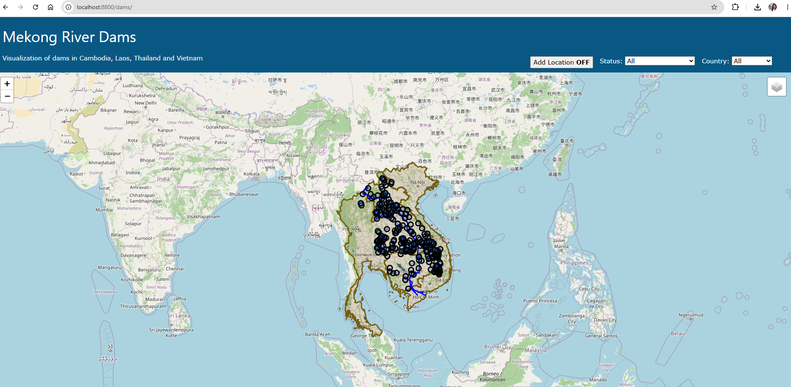
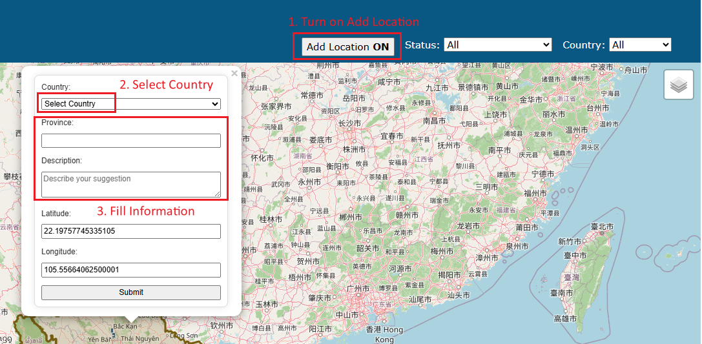
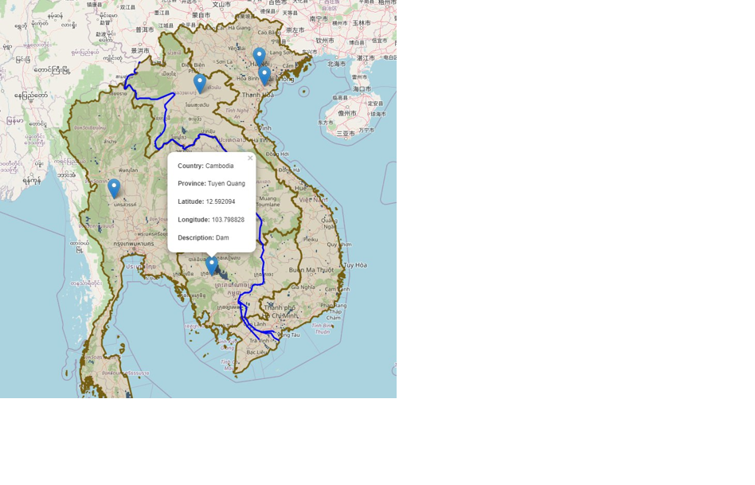
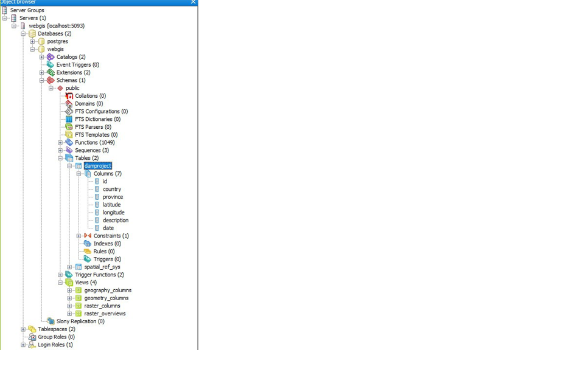
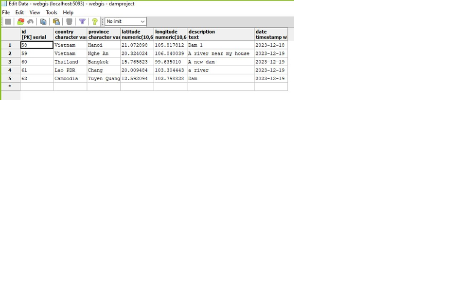

# 🌊 Mekong River Dams — Web-GIS Application

An interactive web mapping application visualizing dams along the Mekong River across four Southeast Asian countries: **Cambodia, Laos, Thailand, and Vietnam**.
Developed as part of the course *Raster Data Processing and Image Enhancement Techniques* at **Trier University, Faculty VI – Spatial and Environmental Sciences**.

---

## 📌 Features

- 🗺️ Interactive map with zoom and layer control
- 📍 Display of dam locations using GeoJSON vector data
- 🌊 Water bodies raster layer (250m spatial resolution)
- 🔍 Filter dams by **Status** and **Country** via dropdown menus
- 💬 Popup information on click (Country, Province, Latitude, Longitude, Description)
- ➕ User input form to add new dam locations directly on the map
- 🗄️ PostgreSQL + PostGIS database to store user-submitted data

---

## 🛠️ Technologies Used

<table>
<tr>
<td valign="top">

**Frontend**

| Technology | Purpose |
|---|---|
| HTML | Page structure |
| CSS | Styling and layout |
| JavaScript | Dynamic map interaction |
| Leaflet.js | Web mapping library |
| GeoJSON | Vector data format |

</td>
<td valign="top">

**Backend**

| Technology | Purpose |
|---|---|
| PHP | Server-side scripting |
| Apache Web Server | Local development server |
| PostgreSQL + PostGIS | Spatial database |
| pgAdmin | Database visual interface |

</td>
<td valign="top">

**GIS Tools**

| Tool | Purpose |
|---|---|
| QGIS | Raster tiling for water bodies layer |
| OpenStreetMap | Default basemap |
| Stamen Terrain | Alternative basemap |

</td>
</tr>
</table>

---

## 🗄️ Database Structure

Database name: `webgis`  
Table name: `damproject`

| Column | Datatype | Description |
|---|---|---|
| id | serial (PK) | Unique identifier |
| country | character | Selected by user |
| province | character | Selected by user |
| latitude | numeric(10,6) | Auto-retrieved from map click |
| longitude | numeric(10,6) | Auto-retrieved from map click |
| description | text | User input |
| date | timestamp | Auto-recorded on submission |

---

## 📂 Data Sources

| Data | Format | Source |
|---|---|---|
| Country boundaries (Vietnam, Laos, Cambodia, Thailand) | GeoJSON | [GADM](https://gadm.org/download_country.html) |
| Mekong River Dams | GeoJSON | [Open Development Cambodia](https://data.opendevelopmentcambodia.net/dataset/greater-mekong-subregion-hydropower-dams-2016) |
| Mekong River | GeoJSON | [Natural Earth](https://www.naturalearthdata.com/downloads/10m-physical-vectors/10m-rivers-lake-centerlines/) |
| Global Surface Water Mask | TIF | [Open Development Mekong](https://data.opendevelopmentmekong.net/dataset/global-surface-water-mask) |
| Stamen Terrain Basemap | PNG | [Stadia Maps](https://docs.stadiamaps.com/map-styles/stamen-terrain/) |

---

## 📸 Screenshots

### Map Overview

### User Input Popup & Information provided by User

<table>
<tr>
<td></td>
<td></td>
</tr>
<tr>
<td align="center">User Input Popup</td>
<td align="center">Information provided by User</td>
</tr>
</table>

### Database Overview & Detailed View

<table>
<tr>
<td></td>
<td></td>
</tr>
<tr>
<td align="center">Database Overview</td>
<td align="center">Detailed View</td>
</tr>
</table>

---

## 👩‍💻 Authors

- **Thi Thu Huong Hoang** — Trier University 

**Supervisor:** Sebastian Pauli  

---

## 📄 License

This project was created for academic purposes at Trier University.
